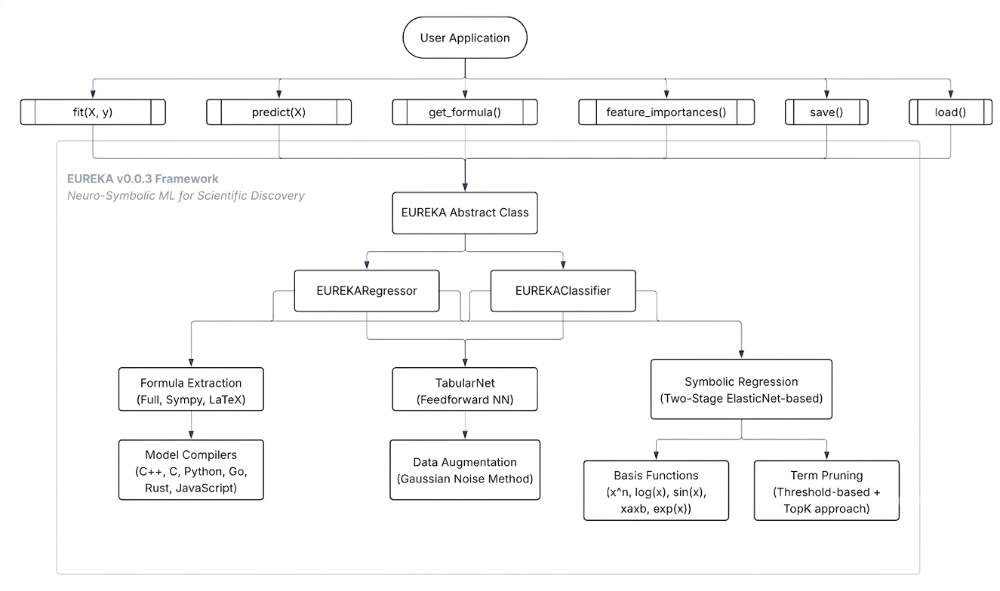

<!-- logo in the center -->
<div align="center">


<h1>Eureka: Neuro-Symbolic ML for Scientific Discovery</h1>
</div>

## Overview

Eureka is a neuro-symbolic machine learning framework inspired by the Kolmogorov-Arnold representation theorem. It combines modern neural networks with symbolic formula extraction to build models that are both predictive and interpretable.

[](https://opensource.org/licenses/MIT)
[](https://github.com/webshubham259/eureka/issues)
[](https://colab.research.google.com/github/webshubham259/eureka/blob/main/examples/eureka-get-started-template-notebook.ipynb)

> **Important Disclaimer**: This is an experimental personal research project. It is not intended for production deployment or real-world critical systems. The goal is to explore interpretable and scientific ML research ideas in a practical prototype.

## Key Features
- 🧠 **Neuro-Symbolic ML**: Combines neural network learning with symbolic mathematics
- 📊 **Automatic Formula Extraction**: Generates human-readable mathematical expressions
- 🎯 **Scikit-learn Compatible**: Familiar `.fit()` and `.predict()` interface
- 🔬 **Research-Focused**: Designed for academic exploration and experimentation
- 📈 **Multi-Task**: Supports both regression and classification problems

## Key Aspects

1. **Neural Implementation**: Eureka uses a specialized architecture combining:
   - Feature transformation layers with interpretable basis functions
   - Symbolic regression for formula extraction (ElasticNet-based)
   - Automatic pruning of insignificant terms
   
   ```python
    class Eureka:
        def __init__(self, hidden_sizes=[64, 64], activation='relu',
                    polynomial_degree=2, alpha=0.1):
            self.neural_net = TabularNet(input_size, hidden_sizes, activation) # NN for predicting values in Data Augmentation (Additional)
            self.augmented_data = self.augment_data(X, y, augmentation_factor=5) # Generate augmented samples (Additional)
            self.symbolic_regression = SymbolicRegression(alpha=alpha, l1_ratio=0.5) # ElasticNet for symbolic regression (Main part)
   ```

2. **Basis Functions**: Core set of interpretable transformations:
   ```python
   SYMBOLIC_FUNCTIONS = {
       'linear': 'x',           # Direct relationships
       'quadratic': 'x^2',      # Non-linear patterns
       'cubic': 'x^3',         # Higher-order relationships
       'interaction': 'x_i x_j', # Feature interactions
       'higher_order': 'x^n',    # Polynomial terms
       'trigonometric': 'sin(x)', # Trigonometric functions
       'exponential': 'exp(x)',  # Exponential growth
       'logarithmic': 'log(x)'  # Logarithmic relationships
   }
   ```

3. **Formula Extraction Process**:
   - Train neural network on raw data
   - Generate augmented samples for better coverage
   - Perform ElasticNet-regularization
   - Prune terms with coefficients below threshold
   - Export human-readable mathematical expressions

## Quick Start

### Installation

#### Method 1: Via PyPI (Recommended)
```bash
pip install -qU eureka
```

#### Method 2: Local Development
```bash
git clone https://github.com/webshubham259/eureka.git
cd eureka
python -m venv .venv
# Windows
.\.venv\Scripts\activate
# macOS/Linux
# source .venv/bin/activate
python -m pip install --upgrade pip
python -m pip install -r requirements.txt
```

#### System Requirements

| Requirement       | Details                              |
|-------------------|--------------------------------------|
| Python            | Version 3.11 or higher               |
| Operating System  | Platform independent (Windows/macOS/Linux) |
| Memory            | Recommended minimum 4GB RAM         |
| Disk Space        | ~100MB for installation (including dependencies) |
| GPU               | Optional (for faster training)      |
| Dependencies      | torch, numpy, scikit-learn, sympy, tqdm   |

### Regression Example

> **Suggestion:** Please ensure that the data is normalized using standard scaling (or another suitable normalization method), as ElasticNet assumes that the model intercept has already been accounted for.

```python
from eureka import EUREKARegressor
from sklearn.metrics import mean_squared_error

# Initialize model
model = EUREKARegressor(
    hidden_sizes=[32, 32], # Hidden layer sizes
    activation='relu', # Activation function (other options: 'tanh', 'leaky_relu', 'elu', 'swish', 'gelu')
    augmentation_factor=5, # Augmentation factor for data generation (default: 1)
    alpha=1.0, # ElasticNet regularization strength (Symbolic regression)
    l1_ratio=0.5, # ElasticNet mixing parameter (0 <= l1_ratio <= 1). 0 is equivalent to Ridge regression, 1 is equivalent to Lasso (Symbolic regression)
    sigma=5, # Standard deviation of Gaussian noise for data augmentation
    top_k=5, # Number of top features to select (Symbolic regression)
    epochs=100, # Number of training epochs
    lr=0.001, # Learning rate
    batch_size=32, # Batch size for training
    verbose=True, # Verbose output during training
    evaluate_nn=True, # Validate neural network performance before full process
    random_state=42 # Random seed for reproducibility (default: 42)
)

# Fit the model
model.fit(X_train, y_train)

# Make predictions
y_pred = model.predict(X_test)

# Evaluate performance
mse = mean_squared_error(y_test, y_pred)
print("Mean Squared Error:", mse)

# Get symbolic formula
formula = model.get_formula() # default: type='original' -> returns all formula without pruning | other options: 'sympy' -> simplified formula using sympy; 'latex' -> LaTeX format
print("Symbolic Formula:", formula)

# Get feature importances
importances = model.feature_importances()
print("Feature Importances:", importances)

# Save the model (optional)
model.save("outputs/model.json")

# Load the model (optional)
loaded_model = EUREKARegressor()
loaded_model.load("outputs/model.json")
```

*Example of the saved symbolic formula (regression model): [outputs/california_housing_model.json](outputs/california_housing_model.json)*


### Classification Example

> **Suggestion:** Please ensure that the data is normalized using standard scaling (or another suitable normalization method), as ElasticNet assumes that the model intercept has already been accounted for.

```python
from eureka import EUREKAClassifier
from sklearn.metrics import accuracy_score

# Initialize model
model = EUREKAClassifier(
    hidden_sizes=[32, 32], # Hidden layer sizes
    activation='relu', # Activation function (other options: 'tanh', 'leaky_relu', 'elu', 'swish', 'gelu')
    augmentation_factor=10, # Augmentation factor for data generation (default: 1)
    alpha=1.0, # ElasticNet regularization strength (Symbolic regression)
    l1_ratio=0.5, # ElasticNet mixing parameter (0 <= l1_ratio <= 1). 0 is equivalent to Ridge regression, 1 is equivalent to Lasso (Symbolic regression)
    sigma=5, # Standard deviation of Gaussian noise for data augmentation
    top_k=5, # Number of top features to select (Symbolic regression)
    epochs=100, # # Number of training epochs
    lr=0.001, # Learning rate
    batch_size=32, # Batch size for training
    verbose=True, # Verbose output during training
    evaluate_nn=True, # Validate neural network performance before full process
    random_state=42 # Random seed for reproducibility (default: 42)
)

# Fit the model
model.fit(X_train, y_train)

# Make predictions
y_pred = model.predict(X_test)

# Evaluate performance
accuracy = model.score(X_test, y_test)
print("Accuracy:", accuracy)

# Get symbolic formulas for each class
formulas = model.get_formula() # default: type='original' -> returns all formula without pruning | other options: 'sympy' -> simplified formula using sympy; 'latex' -> LaTeX format
for i, formula in enumerate(formulas):
    print(f"Class {i} Formula:", formula)
   
# Get feature importances
importances = model.feature_importances()
print("Feature Importances:", importances)

# Save the model (optional)
model.save("outputs/model.json")

# Load the model (optional)
loaded_model = EUREKAClassifier()
loaded_model.load("outputs/model.json")
```

*Example of the saved symbolic formula (classification model): [outputs/iris_model.json](outputs/iris_model.json)*

### Architecture Diagram

#### High-Level Architecture:



#### UML Diagram:

-architecture-oop.png)

## Eureka Symbolic Model Compilers

Eureka provides a set of symbolic model compilers to convert the symbolic formulas generated by the Eureka model into different programming languages.

*Currently, we support: `Python`, `C++`, `C`, `JavaScript`, `Rust`, and `Go`. This allows users to easily integrate the generated formulas into their applications or systems.*

All compilers: [model_compilers/](model_compilers)

### Example of Python Compiler

1. Regression Model:
```python
import numpy as np
import json

def predict(X, symbolic_model):
    X = np.asarray(X)
    X_transformed = evaluate_basis_functions(X, symbolic_model['basis_functions'], 
                                            symbolic_model['n_features'])
    return np.dot(X_transformed, symbolic_model['coefficients'])

if __name__ == "__main__":
    with open('outputs/california_housing_model.json', 'r') as f:
        symbolic_model = json.load(f)
    X = np.random.rand(10, symbolic_model['n_features'])
    y_pred = predict(X, symbolic_model)
    print(y_pred)
```

2. Classification Model:
```python
import numpy as np
import json

def predict(X, symbolic_model):
    X = np.asarray(X)
    X_transformed = evaluate_basis_functions(X, symbolic_model['basis_functions'], 
                                            symbolic_model['n_features'])
    logits = np.dot(X_transformed, np.array(symbolic_model['coefficients_list']).T)
    probabilities = np.exp(logits) / np.sum(np.exp(logits), axis=1, keepdims=True)
    return np.argmax(probabilities, axis=1)

if __name__ == "__main__":
    with open('outputs/iris_model.json', 'r') as f:
        symbolic_model = json.load(f)
    X = np.array([[5.1, 3.5, 1.4, 0.2],
                  [7.0, 3.2, 4.7, 1.4],
                  [6.3, 3.3, 6.0, 2.5]])
    y_pred = predict(X, symbolic_model)
    print(y_pred)
```


## Contributing

We welcome contributions! Key areas of interest:

- Model architecture improvements
- Novel basis function implementations
- Improved symbolic extraction algorithms
- Real-world case studies and applications
- Performance optimizations

Please see [CONTRIBUTING.md](CONTRIBUTING.md) for guidelines.

## Citation

If you use Eureka in your research, please cite:

```bibtex
@software{eureka2026,
  title = {Eureka: Neuro-Symbolic ML for Scientific Discovery},
  author = {Shubham Jangra},
  year = {2026},
  url = {https://github.com/webshubham259/eureka}
}
```

## License
This project is licensed under the MIT License - see the [LICENSE](LICENSE) file for details.
